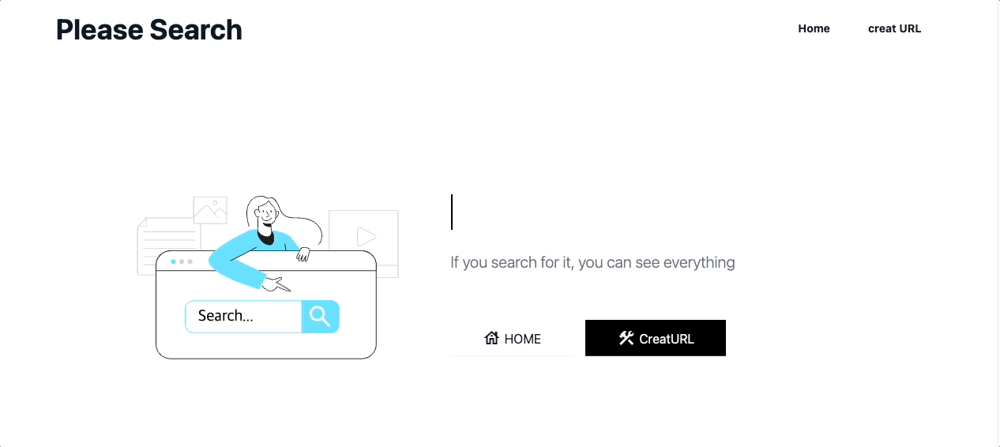
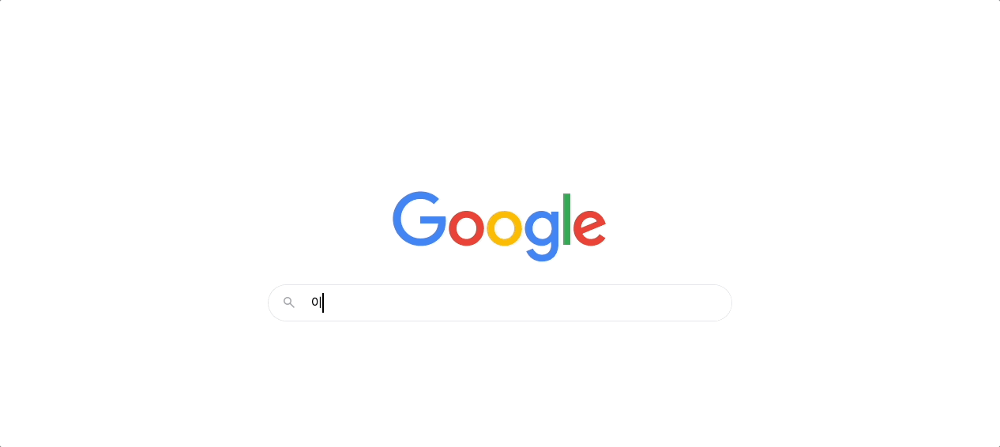

<center>

<br>
(미리보기)
</center>

<hr> <br> <br>

## 🌈 Overview
<hr>
please search 프로젝트는 개발 관련 커뮤니티, 카카오톡 오픈 채팅방에서 검색만 하면 100개 넘는 결과가 나오는 내용을 질문하는 사람에게 검색 결과 페이지로 안내해주기 위해 제작된 프로젝트입니다!

<br>
<br>

## 🍐 어떻게 안내해주나요?
<hr>

[http://search.igorr.tech/g/이곳에%20검색어를%20입력해주세요.] 라는 URL로 접근시 아래와 같이 안내해줍니다.



<hr>

```
# Project setup

npm install

# Compiles and hot-reloads for development

npm run serve

# Compiles and minifies for production

npm run build

# Lints and fixes files

npm run lint

```

### Customize configuration
See [Configuration Reference](https://cli.vuejs.org/config/).
